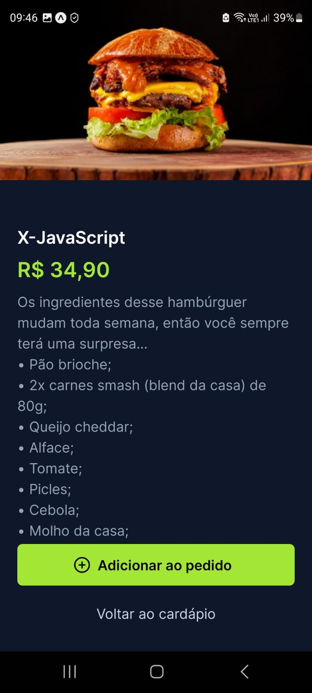
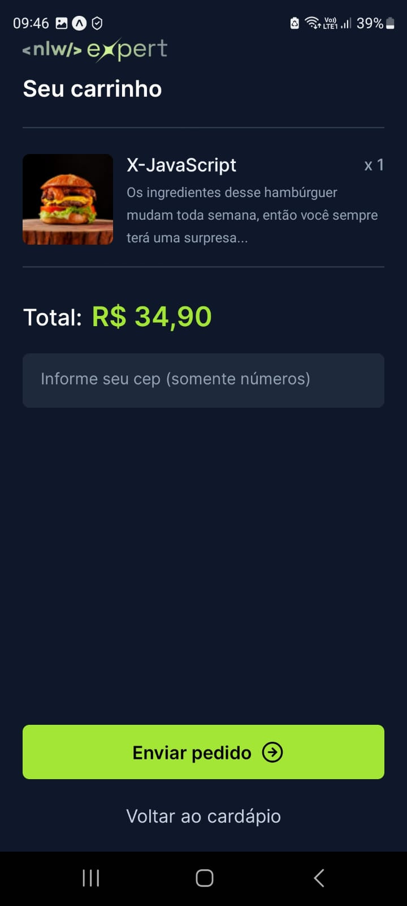
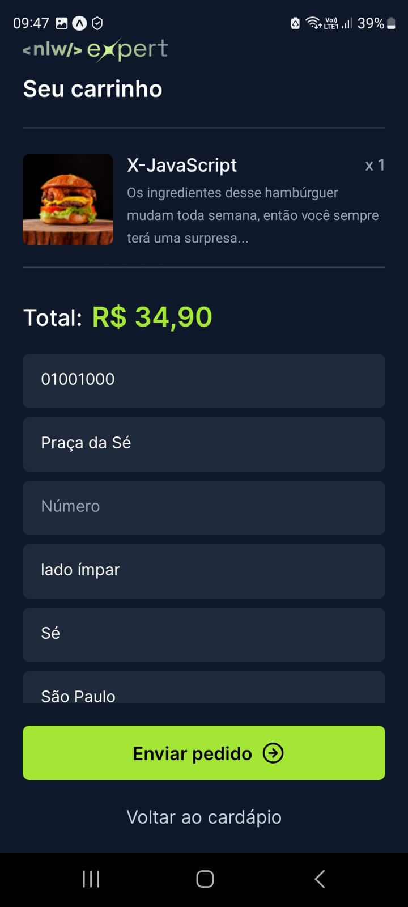

Status: Adicionando funcionalidades

## NLW Expert React-Native

O projeto desenvolvido na NLW Expert é um aplicativo de cardápio que oferece aos clientes a facilidade de selecionar os pratos desejados. Ao concluir o pedido no aplicativo, a solicitação é automaticamente enviada para o WhatsApp do restaurante, agilizando o processo de compra e proporcionando uma experiência mais conveniente aos usuários. Estou adicionando funcionalidades além das aprendidas no NLW Expert.

## Funcionalidades:

- Seleção de pedidos
- Carrinho de compra com listagem dos pedidos
- Filtro de categorias disponíveis
- Ao digitar o cep automaticamente preenche o endereço
- Envio de menssagem para o whatsapp ao fechar o pedido

<hr/>
<br/>

<center>
 <div>
  
  
  
  
  
</div>
</center>
<br/>
<hr/>

## Tecnologias Utilizadas:

- React Native
- Nativewind (TailwindCSS)
- Expo
- Typescript

<br/>
<hr/>

## Instalação

- Instalação do expo/React-Native em sua máquina
- Faça um clone do repositório do projeto no GitHub.
- Navegue até o diretório do projeto.
- Execute o seguinte comando para instalar as dependências:

```
$ npm install
```

## Running the project

```
$ npx expo start
```
## Como visualizar o projeto

```
$ Instale o aplicativo do expo no seu smartphone através da Apple App Store ou Google Play
```
